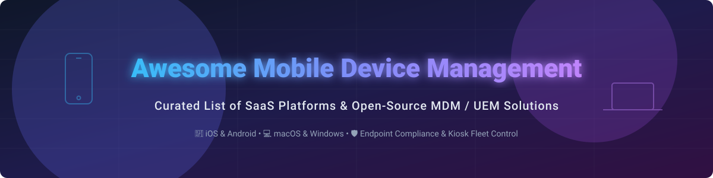

  

# 📱 Awesome Mobile Device Management (MDM) & UEM Ecosystem 🛡️

  
  
  
  
  

> **A curated showcase of commercial SaaS platforms and open-source GitHub projects for Mobile Device Management (MDM) and Unified Endpoint Management (UEM).**  
> *Enrolling, configuring, securing, and monitoring Apple (macOS, iOS), Android, Windows, Linux, and kiosk fleets at enterprise scale.*

---

## 📚 Table of Contents
- [📊 Market & Sector Dynamics](#-market--sector-dynamics)
- [🏢 Commercial SaaS / Hosted Platforms](#-commercial-saas--hosted-platforms)
- [💻 Open-Source GitHub Projects](#-open-source-github-projects)
- [🤝 How to Contribute](#-how-to-contribute)
- [⚠️ Disclaimer](#-disclaimer)
- [💖 Support & Sponsorship](#-support--sponsorship)
- [📈 Star History](#-star-history)

---

## 📊 Market & Sector Dynamics 💡

The global Mobile Device Management (MDM) & Unified Endpoint Management (UEM) market size is estimated at **$13.5 Billion in 2026** and is projected to exceed **$35 Billion by 2032** (CAGR ~17%).

**Sector Structure**: The market is **moderately fragmented**. Heavyweights such as Microsoft Intune and VMware/Omnissa lead enterprise multi-OS fleets, while specialized providers like Jamf and Kandji command Apple-first environments. A thriving tier of mid-market solutions (Scalefusion, Hexnode, Miradore) and flexible open-source solutions (Fleet, MicroMDM) ensure strong competitive diversity rather than a single winner-take-all monopoly.

---

## 🏢 Commercial SaaS / Hosted Platforms ☁️

*Sorted by company scale (revenue/valuation descending).*

| Platform 🚀 | Description 📝 | Company Scale (Revenue / Valuation) 💰 | Starting Price 💵 | Free Tier / Free Trial Limit 🎁 |
| :--- | :--- | :--- | :--- | :--- |
| **[Microsoft Intune](https://www.microsoft.com/en-us/security/business/microsoft-intune)** | Cloud-based endpoint management tightly integrated with Microsoft 365 & Entra ID for multi-OS fleets. | **~$3.0B+ ARR** (Part of $25B+ Security Business) | $8.00/user/month (Plan 1) or $3.50/device/month | 30-day free trial with Enterprise Mobility + Security |
| **[VMware Workspace ONE / Omnissa](https://www.omnissa.com/)** | Enterprise UEM platform supporting multi-platform devices, app delivery, and identity-driven access. | **~$1.5B Revenue** ($4B KKR Spin-off Valuation) | $3.00/device/month (Mobile Essentials) | 30-day evaluation trial |
| **[IBM MaaS360](https://www.ibm.com/products/maas360)** | AI-driven cognitive UEM platform for securing mobile devices, endpoints, apps, and corporate content. | **~$1.0B Security Business Unit** (IBM Enterprise) | $4.00/device/month | 30-day free trial |
| **[Jamf](https://www.jamf.com/)** | Apple-focused device management platform for macOS, iOS, iPadOS, and tvOS. | **~$600M+ ARR** (~$2.2B Market Cap) | $4.00/device/month (Jamf Now) / $5.75/mobile/month (Jamf Pro) | Free forever for up to 3 devices (Jamf Now); 14-day free trial (Jamf Pro) |
| **[ManageEngine MDM Plus](https://www.manageengine.com/mobile-device-management/)** | Feature-rich UEM/MDM solution for mobile and desktop environments across mid-market & enterprise. | **~$1.0B+ Parent Revenue** (Zoho Corp) | $1.28/device/month | Free forever for up to 25 devices; 30-day unlimited free trial |
| **[SOTI MobiControl](https://www.soti.net/products/soti-mobicontrol/)** | Enterprise-grade mobile and IoT device management platform for rugged, field, and smart fleets. | **~$150M+ ARR** | $3.25/device/month (Est. baseline) | 30-day free trial (up to 20 devices) |
| **[Kandji](https://www.kandji.io/)** | Next-generation Apple device management with zero-touch enrollment and automated compliance. | **~$80M+ ARR** ($800M Valuation) | $6.00/device/month (Est. baseline quote) | 14-day free trial (up to 10 devices) |
| **[Miradore](https://www.miradore.com/)** | Cloud-based MDM solution for Android, iOS, macOS, and Windows fleets. | **~$25M Revenue** (Acquired by GoTo) | $2.75/device/month (Premium plan) | Free forever for up to 50 devices; 14-day Premium+ free trial |
| **[Scalefusion](https://scalefusion.com/)** | Multi-OS endpoint, kiosk, and digital signage management solution. | **~$20M ARR** | $2.00/device/month (billed annually) | 14-day free trial (unlimited devices, no credit card required) |
| **[Hexnode](https://www.hexnode.com/)** | Unified endpoint management platform offering strict kiosk enforcement, policy management, and security controls. | **~$15M ARR** | $2.20/device/month (Pro plan) | 14-day free trial (Ultra feature set, no credit card required) |

---

## 💻 Open-Source GitHub Projects 🔓

*Sorted by GitHub Stars_Count (descending). Badges link directly to each repo's stargazers page.*

- **[osquery](https://github.com/osquery/osquery)**   
  ⚡ Foundational open-source SQL-based endpoint visibility engine. Serves as the core telemetry provider for Fleet and enterprise endpoint security agents across macOS, Windows, and Linux.

- **[Fleet](https://github.com/fleetdm/fleet)**   
  ⚡ Open-source multi-platform device management (MDM) & UEM platform built on osquery. Supports MDM, software deployment, patching, and policy visibility across macOS, Windows, Linux, Chromebooks, iOS, and Android with GitOps configuration.

- **[MicroMDM](https://github.com/micromdm/micromdm)**   
  ⚡ API-driven Apple MDM server focused on managing macOS and iOS devices. Ideal for custom Apple device deployment pipelines and automated workflows.

- **[NanoMDM](https://github.com/micromdm/nanomdm)**   
  ⚡ Minimalist, high-performance Apple MDM server and library engineered by the MicroMDM maintainers for easy embedding into modular cloud systems.

- **[Headwind MDM](https://github.com/h-mdm/hmdm-android)**   
  ⚡ Open-source Android MDM platform designed for corporate Android device owner management, application distribution, and kiosk mode configuration.

- **[Flyve MDM](https://github.com/flyve-mdm/web-mdm-dashboard)**   
  ⚡ Open-source mobile device management software enabling web dashboard administration for corporate Android fleet tracking and policy control.

- **[MDMesh](https://github.com/MDMesh-app/MDMesh)**   
  ⚡ Modern self-hosted Android MDM focusing on fleet ownership, locked-down kiosk mode, signed app updates, and a contemporary administration dashboard.

- **[myMDM](https://mymdm.org/)**  
  ⚡ Open-source multi-platform MDM (AGPL) aiming for unified policy enforcement, native agents for Apple, Windows, Android, and Linux, and identity federation in a single portal.

---

## 🛠️ Ecosystem Insights & Architecture 🏗️

- **Multi-Platform Coverage**: Fleet and osquery lead open self-hosted environments across Linux, Mac, and Windows.
- **Apple Fleet Focus**: MicroMDM and NanoMDM offer developer-centric building blocks for Apple Device Enrollment Protocol (DEP/ADE) and SCEP server pipelines.
- **Android Fleet Focus**: Headwind MDM and MDMesh enable dedicated Android kiosk, handheld terminal, and single-purpose device deployments.

---

## 🤝 How to Contribute 📑

1. Fork the repository.
2. Add or update entries in `README.md` following the table or list schema.
3. Ensure accurate product details, specific pricing, and valid links.
4. Submit a Pull Request detailing your changes!

---

## ⚠️ Disclaimer 🔒

- This list is **community-curated** for educational and decision-making purposes—not an endorsement.
- MDM systems hold administrative control over corporate and personal devices. Misconfigurations can wipe endpoints or enforce lockouts. Always thoroughly test policy rollouts in staging environments.
- Open-source MDM provides full data sovereignty but requires maintaining APNs certificates, SCEP infrastructure, and security updates.

---

## 💖 Support & Sponsorship ☕

If you found this repository helpful, please consider **starring** 🌟, **forking** 🍴, or sharing it with fellow IT admins and DevOps engineers!

You can also support the ongoing maintenance of awesome open-source projects via GitHub Sponsors:

---

## 📈 Star History

  Built with ❤️ for IT Admins, Security Engineers, and Fleet Operators worldwide.

